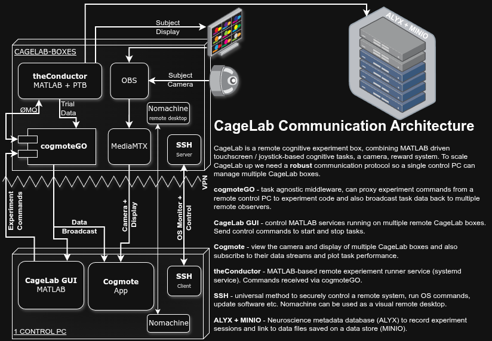

# CageLab Software Frameworks

## Distributed Architecture
CageLab is designed to run in a flexibly distributed architecture, where each CageLab experiment runs on a separate kiosk system with one or more control PCs able to operate any remote system. This allows for higher throughput and flexibility in using of many kiosks to run experiments at scale. CageLab is designed to be controlled remotely[^local], allowing for easy management and monitoring of experiments. We aim to support > 20 experimental kiosks running simultaneously. A single control GUI can remote control any kiosk and all the camera feeds, subject displays and data streams (even across different remote sites) can be observed in a single control interface.  

When running a task, the whole software stack (all communcation, MATLAB task running and display+camera video streaming) consumes around 10% on the miniPC.

## Software Components

- _Kiosk_: **[cogmoteGO](https://github.com/cagelab/cogmoteGO)**: Middleware for communication between control PC and local CageLab instance. HTTP APIs to talk and control remote experients, and broadcast ongoing trial data.
- _Kiosk_: **[theConductor](./theConductor.m)**: A MATLAB service that orchestrates experiments on the CageLab instance. Listens for commands coming from cogmoteGO and then runs CageLab behavioural tasks from the [+cltasks/](+cltasks) folder.
- _Control PC_: **[Cogmote](https://github.com/cagelab/cogmote)**: A cross-platform native app for visualising all remote CageLabs: streaming subject computer display & video feed, and plotting broadcast data (data sent from the running task on each trial). Can do an automatic IP scan to find new remote experiment systems.
- _Control PC_: **[CageLab.mlapp](./CageLab.mlapp)**: A MATLAB GUI for configuring and controlling experiments on any remote CageLab instance. You can even run arbitrary MATLAB commands, or system commands to enable/disable the touch screen, screensaver etc on remote systems for debugging them etc.
- _Both_: **ssh**: `ssh` makes it easy to remote login and manage remote systems. We also use `nomachine` for remote desktop if GUI access is necessary. Both `nomachine` and `ssh` can be configured to run over the VPN.
- _Both_: **VPN**: we use [Netbird](https://netbird.io), a distributed peer-to-peer wireguard VPN that establishes a private and easily managed hostname+IP for each system and encrypts all data. Can also use [Zerotier](https://zerotier.com) or other similar tools. So we just `ssh cagelab-005.cloud.lab` which only other netbird peers can access, securing access to experiment systems.

## Communication

Each CageLab runs [cogmoteGO](https://github.com/cagelab/cogmoteGO), which establishes communication APIs (<https://cogmotego.apifox.cn/>) to:

1. Relay command packets from one/several control PCs machine to a local running MATLAB process (it could be Octave, Python or any other experiment framework; the API is open and easy to read from). The messages are JSON encoded and sent using a HTTP POST request and cogmoteGO forwards them over a local [ØMQ](https://zeromq.org) REQ channel to the PTB/MATLAB process. This is more robust than using TCP/UDP.
2. Data broadacast messages sent from PTB/MATLAB (or other experiment frameworks) can be subscribed to by any number of remote machines.

A GUI called `CageLab.mlapp` is run on your control machine and will send the experiment settings to the CageLab instance[^send]. The CageLab device runs a MATLAB service (via `systemd`) called `theConductor` that receives commands and orchestrates experiments. Each experiment protocol can be run either locally or remotely. We use another app (cross-platform GUI writen in Tauri), Cogmote, to visualise both the subject screen and a camera video feed from the CageLab camera[^camera] and to plot the broadcast data. 

### Viewing the Opticka experiment log remotely

**theConductor** is run vis `systemd` and logs are therefore readable using `journalctl`. You can read the log remotely using ssh to login to the Cagelab instance and then running `journalctl --user -f -u theConductor`. We usually use `tmux` to present a display combing the conductor log, the cogmoteGO log and a btop display.

## Data pipeline

We use the [International Brain Lab](https://doi.org/10.1038/s41592-022-01742-6) metadata pipeline to manage the data generated by CageLab instances, which opticka supports without any other dependencies. Alyx saves session metadata and Minio provides an S3-backed data store for experiment files, pushed to the database / data-store after each session finishes. Alyx & Mino can be run from a server somewhere in your network, to keep all data private, or you could set them up on a VPS hosted remotely if you prefer more flexible access.

[^local]: Though the software can also be run locally, the same task can run on the control PC for debugging, or if you need you can use a mouse/keyboard to run the task from the kiosk (the miniPC has a second HDMI if you wanted operator/client displays), but remote operation is much easier to manage!
[^camera]: Combined via OBS Studio and streamed via the mediamtx server.
[^send]: We send a structure of settings, the code itself and any image resources etc. are run from the Cagelab device using the structure of experiment values to configure the task. This is simpler and lighter than e.g. sending MATLAB class objects or images.
