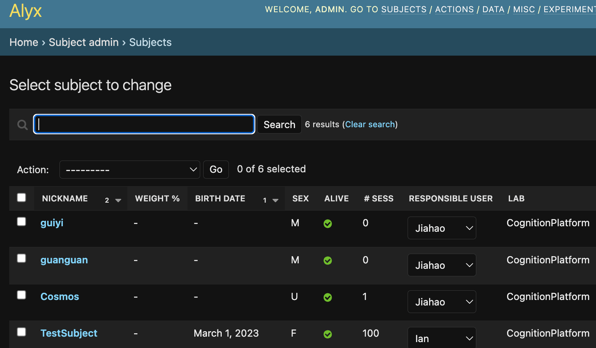
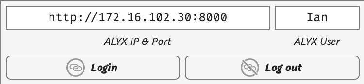
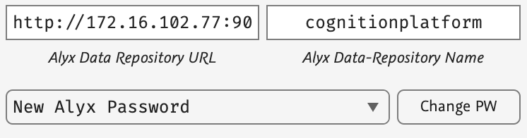
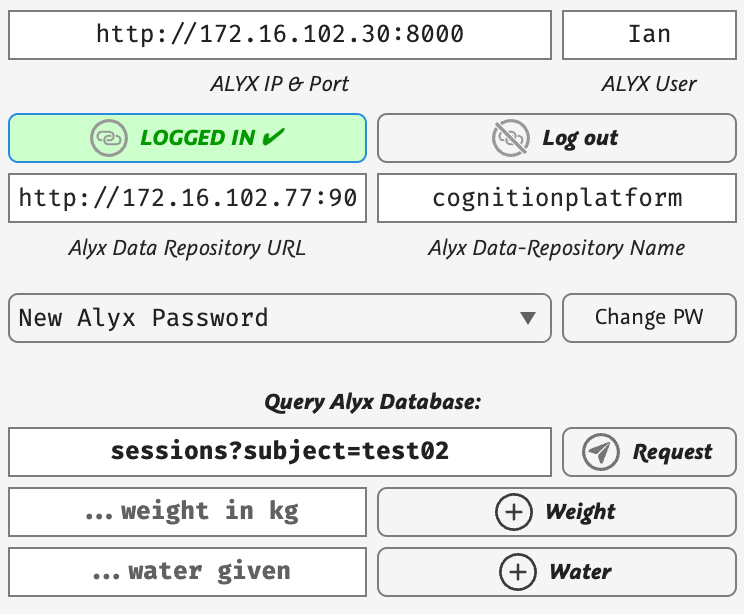
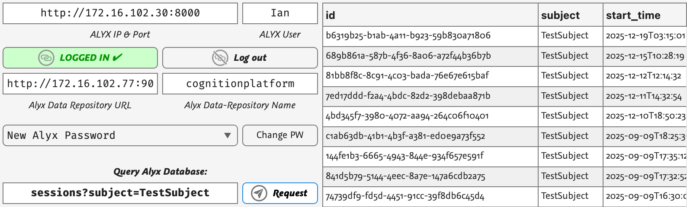
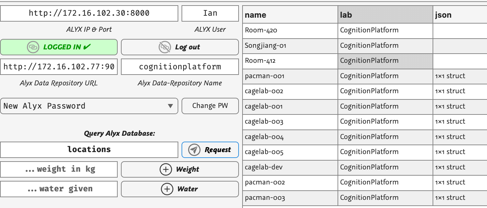
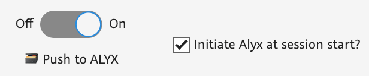
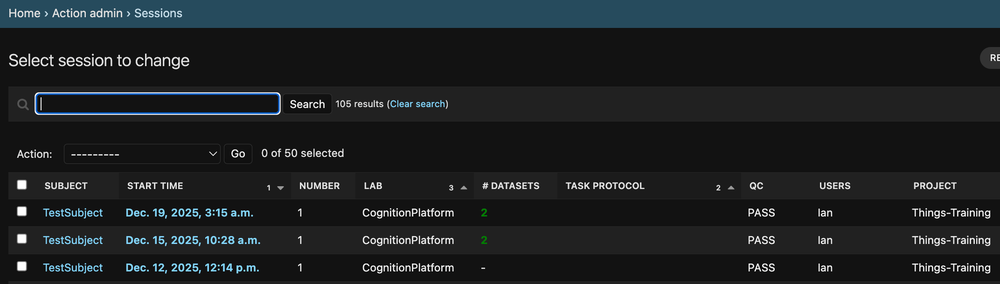

# Using Alyx with CageLab

`#minitoc`{.typst}

Alyx\index{Alyx} is an experiment database made by International Brain Lab. While Alyx is mostly focused on neuroscience tasks in mice, it can be generalised to other species as it supports generic JSON fields, and the core structure across species is more similar than the differences anyway. We use TWO services:

* Alyx database — register subjects, labs, experimenters, projects and tasks; each time a session is run record the experiment metadata and link to the binary experiment files.
* S3 data store ([Minio](https://minio.org) server) — copy raw binary and text experiment files saved by each session linked to the Alyx session metadata. Searching in Alyx can recover the files saved in the S3 data store.

------

In the CageLab GUI there are two main interactions with Alyx:

1) Login / query the database. Not linked to an experiment session.
2) Setup session data and enable CageLab to add the session to the database. The session is added by the remote system, not the control computer.

## BEFORE STARTING: Setting up the Database

> [!IMPORTANT] 
> You **MUST** ensure the Alyx database is setup with the core items you will use to run the session: `Subjects`, `Users`, `Labs`, `Locations`, `Projects`

{#fig:alyx1 width=100%}

Before running any sessions, ensure that the items you will use exist in the Alyx database, login to your Alyx web interface (e.g. http://172.16.102.30:8000 ) and edit the database to add the `Subjects`, the `Users` (Researcher), the `Lab`, and the `Projects` the sessions will be linked to.

## CageLab: (1) Logging in and running queries

CageLab allows you to enter your Alyx IP/port and user name and then login:

{#fig:alyx2 width=50%}

There is also a place to enter the Data repo IP and the data repo (bucket) name, and also to be able to edit the Alyx login password and data repo keys:

{#fig:alyx2 width=50%}

> [!TIP]
> These details are stored using MATLAB's `getSecret` and `setSecret` functions and are stored on the local, not remote machine. The remote machine can be set up with its own secrets or when a session runs the local secrets are sent to the remote system at runtime.

Once logged in you will see the query panel become active:

{#fig:alyx3 width=50%}

Note that you are logged in from your computer. This is nothing to do with a remote cagelab. By logging in it allows you to run Alyx database queries, for example `sessions?subject=TestSubject` will return all sessions recorded by Alyx for subject `TestSubject`:  

{#fig:alyx4 width=50%}

... or for example the lab locations where experiments are run:

{#fig:alyx5 width=50%}

A full list of all the queries you can perform is available from the Alyx database itself: http://172.16.102.30:8000/docs/ 

## CageLab: (2) Running a Session

{#fig:alyx6 width=50%}

When you use CageLab GUI, turn ON push to Alyx. You can also "initiate" Alyx at session start so that Alyx logs a session once it initiates (otherwise it will only register after it is manually ended, thus a crash would not show in Alyx and data be lost).

Then ensure your Session data is accurate and consistent with what is in the database:

{#fig:alyx7 width=50%}

Subject, Lab, User and Location MUST already exist in Alyx or else it will crash. Procedure, Project, Brain Region should also be valid (they are populated after logging in to ensure they are valid). Task protocol is optional. 

When you run the task, Alyx will be initiated with a new Session, and when the session is stopped / ends, the MAT and LOG files will be uploaded to the S3 data server. You can check in the Sessions view:

{#fig:alyx8 width=100%}

You will see the session and can confirm that datasets were added. Note the data also remains in the same local SavedData folder, so it is available even if there is a database crash or other problem.

## ALF File Format and File Naming Conventions

ALF (ALyx Filenames)\index{ALF} is the file naming standard defined by the International Brain Lab for the ONE framework. Files that follow the ALF specification can be discovered, downloaded and analysed with the ONE Python API and the `alyxManager` MATLAB tools, so it is the format CageLab uses for all session files saved locally and registered in Alyx / stored in S3.

### Session Folder Structure

Files are organised in folders by subject name, date and session number:

```
subject/2021-05-27/001
```

The lab name may optionally be included at the top of the tree:

```
lab_name/Subjects/subject/2021-05-27/001
```

CageLab follows exactly this layout under the local save directory (`~/OptickaFiles/SavedData` by default): each session is stored at `<subject>/<YYYY-MM-DD>/<NNN>`, where `NNN` is the zero-padded session number for that day (001, 002, ...). The same relative path is used as the object key prefix when uploading to the S3 data store.

### Filename Anatomy

Every ALF filename has at least two parts — an **object** and an **attribute** — separated by a period. For example `trials.intervals` is the `trials` object with an `intervals` attribute. The complete path pattern is:

```
(lab/Subjects/)subject/date/number/(collection/)(#revision#/)_namespace_object.attribute_timescale.extra.extension
```

* **Object** — the entity the file describes (e.g. `trials`, `spikes`, `wheel`). Every file describing a given object has the same number of rows, so the files of an object together define a table whose columns are the attributes.
* **Attribute** — the column or signal within the object (e.g. `times`, `intervals`, `position`).

Object and attribute names should be in Haskell case (camelCase), e.g. `sparseNoise.xyPos`, and may contain acronyms such as `RFMapStim.intervals`. Underscores, hyphens and spaces are **not** supported, with the exception of `times`, `timestamps` and `intervals`, which have special meanings:

```
trials.goCue_times
```

### Optional Components

| Component | Syntax | Purpose |
|---|---|---|
| **Collection** | `collection/` folder | Sub-folder grouping identical datasets by device or preprocessing, e.g. `probe00/spikes.times.npy` |
| **Revision** | `#date#/` folder | Dated, versioned copy of data so the original is not overwritten, e.g. `#2021-06-01#/`; letters preserve ordering when multiple revisions fall on one date (`#2021-06-01a#`) |
| **Namespace** | `_namespace_` | Prefix for datasets not standardised in the community, surrounded by underscores, e.g. `_ibl_wheel.position` |
| **Timescale** | `_clock` | Appended to the attribute when data are not on the common timescale (seconds from experiment start), e.g. `spikes.times_ephysClock.npy` |
| **Extension** | `.npy` `.csv` `.mat` | Optional in the spec but recommended; use formats well supported in both MATLAB and Python |
| **Extra** | `.<extra>` | Any number of extra parts after the attribute, e.g. UUIDs for uniqueness or part numbers for split files; text after the final period is the extension |

### Relations Between Objects

ALF objects can be related through their attributes. If the attribute name of one file matches the object name of a second file, the first file is guaranteed to contain integers referring to rows of the second. For example `spikes.clusters.npy` contains integer references to the rows of `clusters.brain_location.json`, and `clusters.probes.npy` references rows of `probes.insertion.json`. Take care with plurals (`clusters.probe.npy` would **not** correspond to `probes.insertion.json`).

### Dataset Types

In Alyx, datasets are grouped into **dataset types**, determined by a filename pattern. Each dataset must match **exactly one** dataset type, and the type's description field documents what the files are and how to work with them. For example, the `spikes.times` type matches `spikes.times`, `spikes.times.npy`, `_spikeglx_spikes.times_ephysClock.npy`, and `spikes.times.<uuid>.npy` alike.

### Files Written by CageLab

CageLab (via opticka's `alyxManager`) registers the dataset types below automatically when the database is initialised, then writes the matching files into the session folder when a task runs. The session base name is `<YYYY-MM-DD-HH-MM-SS>_<NNN>_<subject>` (an optional task-specific prefix may be prepended by the task function):

| File pattern | Dataset type | Contents |
|---|---|---|
| `opticka.raw.<name>.mat` | `opticka.raw` | Full raw session data: the `runExperiment` object and task settings, saved with `-v7.3` |
| `opticka.details.<name>.json` | `opticka.details` | JSON encoding of the experiment details / task settings |
| `events.table.<name>.tsv` | `events.table` | Time-stamped event table with HED tag annotations |
| `_matlab_diary.<name>.log` | `_matlab_diary` | MATLAB command window diary output |
| `eyetracking.raw.tobii<...>.mat` | `eyetracking.raw.tobii` | Raw Tobii eye tracking data (when used) |
| `eyetracking.raw.irec<...>` | `eyetracking.raw.irec` | Raw iRec eye tracking data (when used) |
| `eyetracking.raw.eyelink<...>.edf` | `eyetracking.raw.eyelink` | Raw Eyelink EDF file (when used) |

When a session ends, `alyxManager.registerALFFiles()` validates every file in the session folder against the dataset-type filename patterns held in Alyx; files that do not match any pattern are skipped with a warning. On upload to the S3 store the dataset UUID is appended to the filename as an *extra* part (e.g. `opticka.raw.<name>.<uuid>.mat`), as required by the ONE protocol to keep object keys unique.

> [!TIP]
> The full ALF specification is maintained by IBL: <https://int-brain-lab.github.io/ONE/alf_intro.html>. See also [Datasets and their types](https://int-brain-lab.github.io/ONE/notebooks/datasets_and_types.html) and [Listing Alyx Filenames](https://int-brain-lab.github.io/ONE/notebooks/alyx_files.html) for working with ALF files programmatically.
