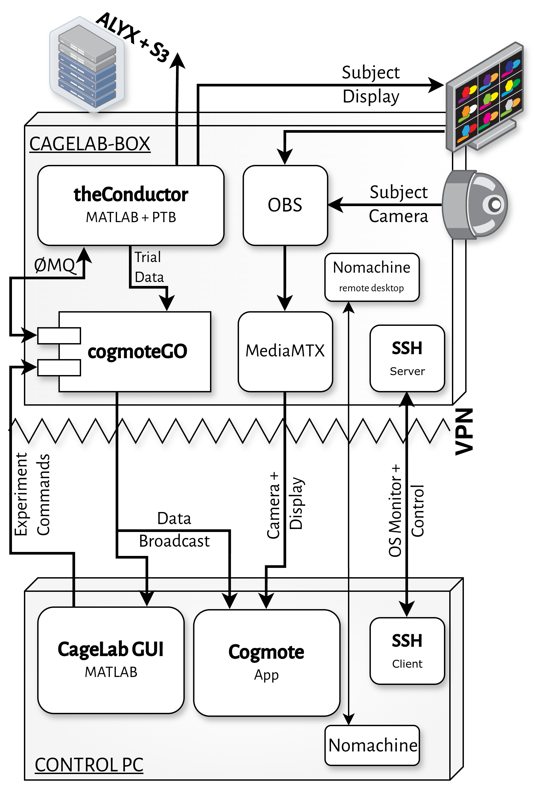
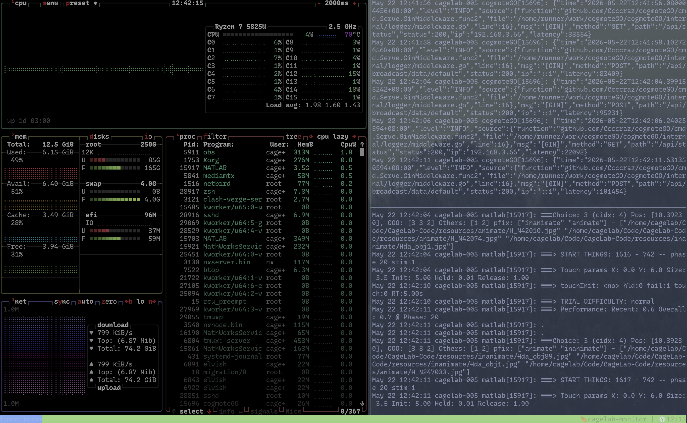
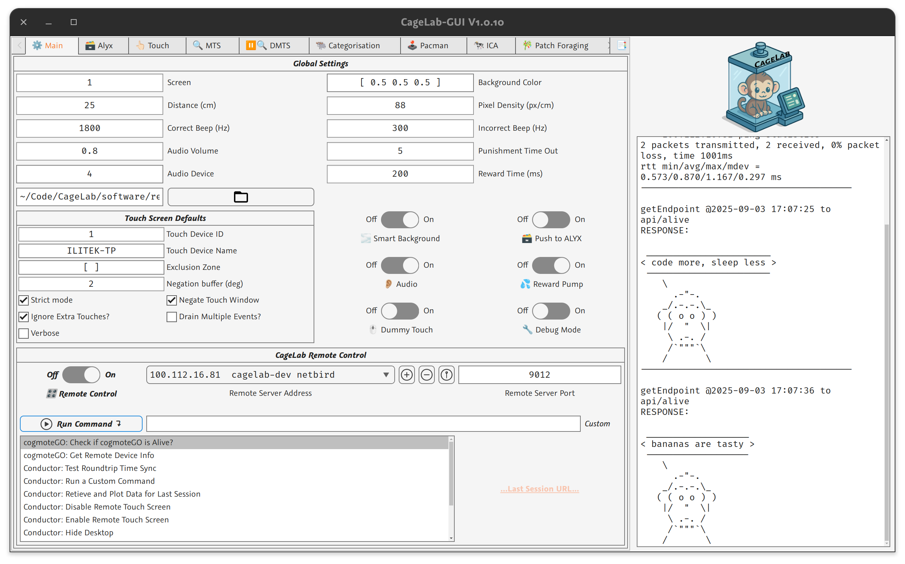
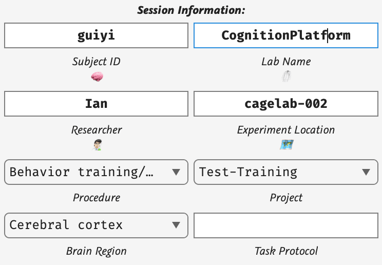

---
# we use Pandoc > Typst to produce the PDF. The recipe
# is available at https://github.com/iandol/dotpandoc/blob/master/defaults/typst-bookly.yaml
title: "CageLab User Guide"
subtitle: "Remote Neuroscience Experiments with CageLab"
author: 
  - name: "CageLab Development Team"
date: "2026"
toc: true
toc-depth: 2
number-sections: true
colorlinks: true
papersize: a4
fontsize: 12pt
theme: modern # classic, modern, fancy, obook, orly, pretty
querverweis: # cross-ref pandoc plugin
  labels: ['html','plain','odt']
  link-labels: true
  numbering: "1.1"
---

# Introduction

CageLab is a modular, network-distributed system for running remote neuroscience behavioural experiments. It separates the **Control-PC** (the experimenter's workstation, usually in an office) from one or more **CageLab-Box**es (the cage-attached computer driving stimuli, touch, reward, and video recording), allowing a single researcher to manage cognitive training and testing of many subjects across multiple home environments from one place. \index{CageLab}

```{=typst}
#minitoc
```

## The Big Picture

{#fig:components width=70%}

CageLab is a combination of hardware and software. The software uses several core software components, connected over a local network or VPN.

The system is built on four principles:

1.  **Distributed architecture[^dis]** --- the experimenter configures tasks and monitors behaviour from their **Control-PC**; the **CageLab-Box** runs the experiment in the home environment with deterministic timing via Psychtoolbox (PTB) \index{Psychtoolbox} \index{PTB|see{Psychtoolbox}}. 
2.  **HTTP API + ØMQ bridge** --- all external commands from the Control-PC arrive via `cogmoteGO`'s HTTP REST API; internally, `cogmoteGO` bridges these commands to `theConductor` over a local ZeroMQ (ØMQ) connection. \index{ZeroMQ}
3.  **Automation-first** --- Ansible playbooks bootstrap, update, and maintain groups of CageLab-Boxes simultaneously; systemd services keep critical processes alive and self-healing. APIs enable automation of task/session management. \index{Ansible} \index{systemd}
4. **Open Data Standards** --- each experimental session can be registered using an open-science database system (Alyx), data stored using S3 storage, and metadata generalised using HED tags. It makes managing experiments more open, analysis more efficient, and more easily shared with others when the time comes for publication.

> [!info]
> While @fig:components shows just one **Control-PC** and one **CageLab-Box**, the system supports a many-to-many configuration.

[^dis]: If necessary a researcher can run the control interface and experiment from the same system; this is useful for debugging & development for example, or if there is no Control-PC or no network available. You can either use a remote keyboard/mouse, or a portable WiFi router and a nearby laptop to manage the CegaBox. Remote control is simply more efficient. 


## Key Components at a Glance

| Component | Role | Language | Runs On |
|-----------|------|----------|---------|
| **cogmoteGO** | HTTP API / ØMQ bridge, WebRTC streaming | Go | CageLab-Box |
| **CageLab GUI** | Experiment design, control, and monitoring \index{CageLab GUI} | MATLAB | Control-PC |
| **theConductor** | ØMQ REP server, receives commands and launches tasks | MATLAB | CageLab-Box |
| **+cltasks** | Behavioural task library (MTS, IED, Oddball, etc.) | MATLAB | CageLab-Box |
| **OBS Studio** | Video recording of experimental sessions\index{OBS Studio} | C++ (Flatpak) | CageLab-Box |
| **MediaMTX** | RTSP/WebRTC media server for low-latency streaming\index{MediaMTX} | Go | CageLab-Box |
| **SSH** | remote access server/client\index{SSH}  | System | Both |
| **Ansible** | Group automation, updates, and maintenance | Python | Control-PC |
| **NetBird** | WireGuard-based VPN mesh for cross-site connectivity\index{NetBird}  | Go | Both |
| **Alyx** & **Minio* | Optional but recommended Database\index{Alyx} and data server to store daily session [meta]data  | Python | Separate server |
:Key components []{#tbl:comps}

## Architecture Deep-Dive: HTTP API + ØMQ Local Bridge

`cogmoteGO` exposes two interfaces:

-   **External**: an HTTP REST API on port `9012`, used by the Control-PC (CageLab GUI, curl, Ansible). Full API documentation: <https://cogmotego.apifox.cn/>.
-   **Internal**: a local ØMQ connection to `theConductor`, used only within the CageLab-Box.

The communication stack works as follows:

1.  `cogmoteGO` starts first, binding its HTTP API on port `9012` and preparing an internal ØMQ channel for local communication.
2.  `theConductor` starts next. It opens a **REP** ØMQ socket on port `6666` and calls `cogmoteGO`'s HTTP API (`POST /api/cmds/proxies`) to register itself as a **command proxy** named `matlab`. This tells cogmoteGO where to forward incoming commands.
3.  A handshake occurs: `cogmoteGO` sends `{"request":"Hello"}` over the local ØMQ channel; `theConductor` responds `{"response":"World"}`. The proxy is now active.
4.  When the Control-PC sends a command (e.g., to run a task), it POSTs JSON to `cogmoteGO`'s HTTP API. `cogmoteGO` bridges the command to `theConductor` via the internal ØMQ proxy, waits for the reply, and returns it as the HTTP response.
5.  `theConductor`'s `process()` loop polls the ØMQ socket for incoming messages, dispatches commands (`run`, `echo`, `gettime`, `commandlist`, etc.), and sends structured replies back through the proxy.


```{.mermaid #fig:messaing caption="Message Passing" export_scale=5 width=100%}
sequenceDiagram
    participant GUI as CageLab GUI<br/>(Control-PC)
    participant CG as cogmoteGO<br/>(HTTP API :9012)
    participant TC as theConductor<br/>(ØMQ REP :6666)

    CG->>CG: Start HTTP API + internal ØMQ
    TC->>CG: POST /api/cmds/proxies (register 'matlab')
    CG-->>TC: 201 Created
    CG->>TC: ØMQ {"request":"Hello"}
    TC-->>CG: ØMQ {"response":"World"}

    Note over GUI,TC: Proxy active — Control-PC commands flow through HTTP API

    GUI->>CG: POST /api/cmds/run {"command":"cltasks.startMTS","data":{...}}
    CG->>TC: ØMQ (routed via proxy)
    TC->>TC: eval(command(data))
    TC-->>CG: ØMQ {"command":"running_command","data":{...}}
    CG-->>GUI: HTTP 200 {"command":"running_command","data":{...}}
```

## Supported Hardware

- **Touchscreens**: ILITEK-TP (tested) and other X11-compatible touch panels (controlled via `toggleInput` and `touchManager`)\index{Touchscreen!touchManager}
- **Reward Pumps**: PTBSimia-managed peristaltic/syringe pumps\index{PTBSimia}
- **Audio**: Standard sound cards via Opticka's `audioManager`\index{Audio!audioManager}
- **Camera**: Anything compatible with OBS Studio (hardware-accelerated encoding (VAAPI/NVENC))\index{Video recording|see{OBS Studio}}
- **Screens**: Standard 60--240 Hz LCD/OLED panels or dedicated research panels via DisplayPort/HDMI (FreeSync/G-Sync compatible) thanks to PTB.

> [!info]
> PTB has excellent hardware support, and many other hardware can be interfaced with. For example, if you want to linearise the gamma of the display, we can connect to professional colorimeters / spectrophotometers for display calibration etc.


# Dependencies & Installing\index{Installation}


This chapter covers software installation for both the **CageLab-Box** (the remote experiment computer/kiosk) and the **Control-PC** (the researcher's workstation).

```{=typst}
#minitoc
```

## Software Stack Overview

```{.mermaid #fig:deps caption="Installation requirements" export_scale=5 width=100%}
flowchart TD
    subgraph Core[Core Dependencies]
        MATLAB[MATLAB R2025a+]
        PTB[Psychtoolbox-3]
        opticka[opticka Framework]
    end

    subgraph Messaging[Communication]
        NetBird[NetBird VPN]
        cogmoteGO[cogmoteGO]
        matlabjzmq[matlab-jzmq]
        PTBSimia[PTBSimia]
    end

    subgraph Tools[System Tools]
        pixi[pixi package manager]
        eget[eget binary installer]
        git[git + gitee remotes]
        tmux[tmux + tmuxp]
    end

    subgraph Media[Media Stack]
        OBS[OBS Studio -- Flatpak]
        MTX[MediaMTX]
    end
```

## CageLab-Box Installation {#install-box}

The CageLab-Box runs **Ubuntu Linux** (24.04 LTS or later) with the **i3 window manager**\index{i3 window manager} for a minimal, uncomposited X11 environment that has two benefits: (1) PTB timing precision is improved[^1]; (2) i3 has no touchable GUI, stopping subjects from manipulating any desktop widgets when no task is running.

[^1]: Composited desktop environments (GNOME, KDE) introduce unpredictable frame drops and timing jitter. i3 is a tiling window manager with no compositor, ensuring PTB can take full control of the display.

### Step 1: Bootstrap

For a fresh system, we have a bootstrap script that will install dependencies and set up the correct file locations. Clone the CageLab-Code repository and run the bootstrap script:

```bash
mkdir -p ~/Code
cd ~/Code
git clone --recurse-submodules https://gitee.com/CogPlatform/CageLab-Code.git
cd CageLab-Code/setup
./bootstrap.sh
```

The bootstrap script performs the following:
- Installs essential APT packages (git, curl, zsh, i3, tmux, flatpak, etc.)
- Installs `pixi` (cross-platform package manager)\index{pixi}
- Installs NetBird VPN\index{Netbird}
- Optionally: installs MATLAB via MathWorks Package Manager (MPM)\index{MATLAB}
- Installs `cogmoteGO` via its install script
- Installs NoMachine remote desktop
- Installs `eget` and MediaMTX
- Clones all core repositories from Gitee
- Sets up the PTB/Opticka MATLAB path
- Runs `makelinks.sh` to symlink scripts, configs, and systemd services\index{makelinks.sh}

### Step 2: Run makelinks.sh

It is recommended to regularly run `makelinks.sh`, and especially after any code changes:

For CageLab:

```bash
~/Code/CageLab-Code/setup/makelinks.sh
```

For Control-PC:

```bash
~/Code/CageLab-Code/setup/makelinks.sh -c
```

This symlinks ZSH configs, script files, systemd services, SSH config, i3 config, tmux config, and the pixi manifest. Use the `-c` flag for Control-PC to ensure Ansible config is correctly linked.

### Step 3: Verify Services on CageLab

```bash
systemctl --user status cogmoteGO.service
systemctl --user status theConductor.service
systemctl --user status mediamtx.service
systemctl --user status obs.service
```

## Control-PC Installation {#install-control}


On the Control-PC\index{Control-PC!installation}, you can install the same services as CageLab-Box if you want to perform any testing, however in general these are not necessary. We use Ubuntu, and our scripts are designed for Posix systems (any Linux, macOS), so some scripts will need to be modified (or run using WSL) on Windows. Running Linux everywhere makes problem solving a bit smoother, and gets staff used to Linux and thus able to better support the remote system. You typically need:

1.  **MATLAB** with the same toolboxes as the CageLab-Box (Curve Fitting, Instrument Control, Optimization, Parallel Computing, Signal Processing, Statistics and Machine Learning).
2.  **The CageLab GUI** (part of CageLab-Code, running inside MATLAB).
3.  **Ansible** for group management:

```bash
uv tool install ansible
ansible-galaxy collection install ansible.posix
```

4.  **SSH keys** configured for Control-PC and each CageLab-Box (see [Network Setup]).

### MATLAB Dependencies

These MATLAB toolboxes are not strictly required but they are what we normally install:\index{MATLAB!toolboxes}

| Toolbox | Purpose |
|---------|---------|
| MATLAB | Core runtime |
| Curve Fitting Toolbox | Data fitting for analysis |
| Instrument Control Toolbox | Hardware communication |
| Optimization Toolbox | Parameter optimization |
| Parallel Computing Toolbox | Multi-core task execution |
| Signal Processing Toolbox | Signal analysis |
| Statistics and Machine Learning Toolbox | Data analysis, classification |
: MATLAB toolboxes []{#tbl:toolboxes}

All are installable via MPM on Linux:

```bash
products='MATLAB Curve_Fitting_Toolbox Instrument_Control_Toolbox Optimization_Toolbox Parallel_Computing_Toolbox Signal_Processing_Toolbox Statistics_and_Machine_Learning_Toolbox'
mpm install --release=R2026a --products=$products
```

### Code Repository Structure

All CageLab code is version-controlled via Git, and synced from Github (where we do our main development) to Gitee (accessible from behind the Great Firewall). The Gitee repositories: \index{Gitee}

| Repository | URL | Purpose |
|------------|-----|---------|
| CageLab-Code | <https://gitee.com/CogPlatform/CageLab-Code.git> | Main CageLab codebase |
| Psychtoolbox | <https://gitee.com/CogPlatform/Psychtoolbox.git> | PTB-3 fork\index{Psychtoolbox-3} |
| opticka | <https://gitee.com/CogPlatform/opticka.git> | Core stimulus/task framework\index{opticka} |
| matmoteGO | <https://gitee.com/CogPlatform/matmoteGO.git> | MATLAB ØMQ client\index{matmoteGO} |
| PTBSimia | <https://gitee.com/CogPlatform/PTBSimia.git> | Reward pump interface\index{PTBSimia} |
| matlab-jzmq | <https://gitee.com/CogPlatform/matlab-jzmq.git> | Java ØMQ bindings for MATLAB\index{matlab-jzmq} |
| PacmanTask | <https://gitee.com/CogPlatform/PacmanTask.git> | Task-specific code\index{PacmanTask} |
: The Git Repositories []{#tbl:repositories}

# Network Setup \index{Network setup}

```{=typst}
#minitoc
```

CageLab requires reliable network connectivity between the Control-PC and all CageLab-Boxes. This chapter covers the three networking layers: NetBird VPN, SSH, and NoMachine remote desktop.

> [!warning]
> You do not need Netbird, and can run CageLab over a local-only network for some limited security. We recommend Netbird as it provides a second layer of security. The cost is a somewhat more involved setup. 

```{.mermaid #fig:comms caption="Recommended Multi-CageLab communication" export_scale=5 width=100%}
flowchart TD
    subgraph CP[Control-PC]
        A[Experimenter]
    end

    subgraph VPN[NetBird WireGuard Mesh]
        NB[Encrypted P2P Tunnel]
    end

    subgraph CBox1[CageLab-Box 001]
        CG1[cogmoteGO :9012]
        SSH1[SSH :22]
        NX1[NoMachine :4000]
        TC1[theConductor :6666]
    end

    subgraph CBox2[CageLab-Box 002]
        TC2[theConductor :6666]
        NX2[NoMachine :4000]
        SSH2[SSH :22]
        CG2[cogmoteGO :9012]
    end

    A <-->|SSH| NB
    A <-->|NX Client| NB
    A <-->|HTTP| NB
    NB <--> SSH1
    NB <--> NX1
    NB <--> CG1
    NB <--> SSH2
    NB <--> NX2
    NB <--> CG2
    CG1 <--> TC1
    CG2 <--> TC2
```

For setup you should ensure you set up SSH using a password first, then you can add an SSH key, then install Nomachine and finally Netbird. You must then setup SSH and Nomachine to use the Netbird IP for maximum protection.

## SSH Configuration \index{SSH}

SSH is a primary command-line interface to each CageLab-Box. Key-based authentication avoids password prompts, and can be used both for `ssh` from the terminal and the visual remote desktop Nomachine.

### Creating SSH Keys \index{SSH!key generation}

SSH keys are more secure than using passwords, and also more convenient. You can even add a pass-phrase to an SSH key if you are particularly concerned (we don't tend to do that, as it can complicate some automations). There are two parts to a SSH key, a **private** and **public** key. The **private** key is kept **ONLY** on the **Control-PC** and *must be kept private* and not shared to unauthorised people. The public key can be installed on all CageLabs. On the Control-PC:

```bash
ssh-keygen -t ed25519 -f ~/.ssh/cagelab -C "cagelab-control"
ssh-copy-id -i ~/.ssh/cagelab.pub cagelab@x.x.x.x
```

You must edit `/etc/ssh/sshd_config` to ensure only the Netbird IP is accepted using `ListenAddress`, and disable password access with `PasswordAuthentication no`.


## NetBird VPN \index{NetBird}\index{VPN|see{NetBird}}

NetBird is a WireGuard-based mesh VPN that provides encrypted peer-to-peer connectivity. It is essential when CageLab-Boxes are on a different physical network from the Control-PC (e.g., separate lab networks or across institutions).

### Installation

Install NetBird via the official APT repository (automated via Ansible playbook `install_netbird.yaml` or the bootstrap script):

```bash
curl -fsSL https://pkgs.netbird.io/install.sh | sh
```

### Device Registration

Each device must be registered with your NetBird account using a setup key:

```bash
netbird up --setup-key YOUR_SETUP_KEY
```

The setup key can be stored as the environment variable `NETBIRD_SETUP_KEY` for automated provisioning via Ansible\index{Ansible!playbooks}:

```bash
NETBIRD_SETUP_KEY=your-key ansible-playbook -l cagelab -K ansible/playbooks/install_netbird.yaml
```

### Managing the Mesh

-   **View connected peers**: `netbird status`
-   **Access a box via its NetBird IP**: Once connected, each box gets a stable VPN IP (e.g., `100.112.x.x` or IPv6 `fd00:1:1::x`), and a hostname like `cagelab-001.cloud.lab` reachable from any other peer in the mesh.

### Devices Config (~/.ssh/config) {#sshconfig}

`makelinks.sh` symlinks a pre-configured SSH config from `setup/config/sshconfig`. You MUST edit this to be relelvant to your devices and network:

```
Host cagelab-001
    HostName cagelab-001.cloud.lab
    User cagelab
    IdentityFile ~/.ssh/cagelab
    IdentitiesOnly yes

Host cagelab-002
    HostName cagelab-002.cloud.lab
    User cagelab
    IdentityFile ~/.ssh/cagelab
    IdentitiesOnly yes
```

Then you can use just the name to `ssh` into the remote system:

```bash
ssh cagelab-002               # via SSH config
ssh cagelab@192.168.3.22 -i ~/.ssh/cagelab  # manual
```


**Naming convention**: The `.ssh/config` and the ansible inventory file (`ansible/inventory/hosts`) defines several systems. Boxes accessed via DNS names (`*.cloud.lab`) are in groups like `cagelab`; boxes accessed via raw IPs have `i`-suffixed names (e.g., `cagelab-001i`). This dual-entry approach lets SSH/Ansible target the same box over different network paths if necessary, though you should prefer Netbird routes where possible.

## NoMachine Remote Desktop \index{NoMachine}

SSH is very powerful, however sometimes a desktop is required. NoMachine provides a high-performance remote desktop for GUI access to the CageLab-Box. It's useful for troubleshooting PTB rendering issues, configuring OBS, or inspecting the desktop state.

### Installation

Via Ansible:

```bash
ansible-playbook -l cagelab -K ansible/playbooks/install_nomachine.yaml
```

Or manually:

```bash
curl -L -o /tmp/nomachine.deb https://web9001.nomachine.com/download/9.6/Linux/nomachine_9.6.3_1_amd64.deb
sudo dpkg -i /tmp/nomachine.deb
```

Next you want to edit the `/usr/NX/etc/server.cfg` file and ensure only SSH key authentication is used, and the listen address is your secure IP address:

```
AcceptedAuthenticationMethods NX-private-key
NXdListenAddress 100.112.x.x
```

To set up the public SSH key, you can copy the SSH key you have already copied to CageLab to also serve login for Nomachine:

```bash
cp ~/.ssh/cagelab.pub .nx/config/authorized.crt 
```

### Connection

Use the NoMachine client (available on macOS, Windows, and Linux) and connect to the CageLab-Box's IP/hostname on port `4000`, using the private part of the SSH key you set up. The LightDM autologin playbook (`install_lightdm_autologin.yaml`) ensures the desktop session starts automatically on boot\index{LightDM}.

# Managing Running CageLab Services

```{=typst}
#minitoc
```

Each CageLab-Box runs several `systemd` user services\index{Services!managing} that must be kept alive for the system to function. This chapter covers the service lifecycle: startup, monitoring, restarting, and stopping\index{systemd!user services}.

> [!info]
> For most of this section, the commands are run via `ssh` on the **CageLab-Box**. See section [](#ansible) for how to use `ansible` to run blocks of remote command *from* the **Control-PC**.

## Service Architecture

```{.mermaid #fig:services caption="Service relationships" export_scale=5 width=90%}
flowchart TD
    Boot[System Boot] --> LightDM[LightDM Autologin]
    LightDM --> i3[i3 Window Manager]
    Toggle[toggleInput.service\nDisables touchscreen at login]
    CG[cogmoteGO.service\nHTTP API + ØMQ Bridge]
    TC[theConductor.service\nMATLAB REP Server]
    MTX[mediamtx.service\nMedia Streaming Server]
    MTX --> OBS[obs.service\nVideo Recording]
```

## Service List

| Service | Type | Purpose | Startup Order |
|---------|------|---------|:---:|
| `toggleInput.service` | Oneshot | Disables touchscreen during boot to prevent subject interaction with OS | 1st |
| `cogmoteGO.service` | Simple | HTTP API and ØMQ bridge on `:9012` | 2nd |
| `theConductor.service` | Simple | MATLAB-based REP server that runs behavioural tasks | 3rd |
| `mediamtx.service` | Simple | RTSP/WebRTC media server for video streaming | 4th |
| `obs.service` | Simple | OBS Studio for session video recording | 5th |
: The main services that run CageLab systems []{#tbl:services}

## Convenience Scripts

CageLab provides ZSH convenience scripts in `~/bin/` (symlinked from `scripts/`):

| Script | Action |
|--------|--------|
| `cagelab-start` | [Re]start all services (toggleInput → cogmoteGO → theConductor → mediamtx → obs) |
| `cagelab-stop` | Stop all services in reverse order |
| `cagelab-reset` | Stop + daemon-reload + restart cogmoteGO and theConductor; disable touchscreen |
| `cagelab-reset-services` | Full service reset: disable old, re-link from repo, re-enable |
| `cagelab-reset-code` | Force-reset all code repositories to latest upstream |
| `cagelab-reset-OBS` | Stop + restart OBS and mediamtx (for streaming issues) |
| `cagelab-status` | Check if cogmoteGO is running and show latest broadcast data |
| `cagelab-update` | Full update: stop services → reset code → update cogmoteGO/pixi/mediamtx/flatpak → restart |
| `cagelab-monitor` | Launch tmuxp session with CPU monitor + journalctl for cogmoteGO and theConductor |
: CageLab scripts []{#tbl:scripts}

### Usage Examples

```bash
# Quick restart of core services
cagelab-reset

# Full update after code changes
cagelab-update

# Check if everything is running
cagelab-status

# Monitor logs and CPU in real time
cagelab-monitor
```

## Manual systemctl Commands \index{systemctl}

For fine-grained control, use `systemctl --user`:

```bash
# Check status
systemctl --user status cogmoteGO.service
systemctl --user status theConductor.service

# View recent logs
journalctl --user -u cogmoteGO.service -n 50 --no-pager

# Follow logs in real time
journalctl --user -f -u theConductor.service

# Restart a single service
systemctl --user restart cogmoteGO.service

# Enable/disable at boot
systemctl --user enable cogmoteGO.service
systemctl --user disable obs.service

# Reload systemd after editing unit files
systemctl --user daemon-reload
```

## cagelab-monitor with tmuxp

The `cagelab-monitor` command launches a tmuxp session with three panes\index{tmuxp}\index{tmux}:



- **Top-left**: `htop` (CPU/memory monitor)
- **Bottom-left**: `journalctl` following `cogmoteGO` logs
- **Right**: `journalctl` following `theConductor` logs

**tmux quick reference** (prefix is `Ctrl-a`):

| Keystroke | Action |
|-----------|--------|
| `Ctrl-a` `s` | Show session list |
| `Ctrl-a` `-` | Split vertically |
| `Ctrl-a` `\|` | Split horizontally |
| `Ctrl-a` `x` | Kill pane (confirm with `y`) |
| `Ctrl-a` `d` | Detach from session |
| `Ctrl-a` arrow | Navigate panes |
: tmux keyboard commands []{#tbl:keys}

The tmuxp config is at `~/.config/tmuxp/cagelab-monitor.yaml` and is symlinked by `makelinks.sh`.

## touchscreen Management

The `toggleInput` script enables or disables touchscreen devices via `xinput`. This is critical: subjects must not interact with the OS desktop\index{Touchscreen!management}.

```bash
toggleInput disable              # disable default device (ILITEK-TP)
toggleInput enable               # enable default device
toggleInput disable ILITEK-TP    # disable specific device
toggleInput enable "Touchpad"    # enable specific device
```

`toggleInput.service` runs at boot to disable the touchscreen. Tasks re-enable it when needed, and `cagelab-reset` disables it afterwards.

## OBS Recording Control

OBS Studio recording can be controlled via its WebSocket API using the `control-OBS.py` script\index{OBS Studio!control-OBS.py}:

```bash
# Start recording
python3 ~/Code/CageLab-Code/scripts/control-OBS.py start --password YOUR_WS_PASS

# Stop recording
python3 ~/Code/CageLab-Code/scripts/control-OBS.py stop

# Toggle recording
python3 ~/Code/CageLab-Code/scripts/control-OBS.py toggle

# Check status
python3 ~/Code/CageLab-Code/scripts/control-OBS.py status

# Control remote OBS via SSH tunnel
python3 ~/Code/CageLab-Code/scripts/control-OBS.py status \
    --ssh-host cagelab-001.cloud.lab --ssh-user cagelab
```

The password can be set via the `OBS_WS_PASSWORD` environment variable.

## Data Management: cagepush and cagepull

Two powerful ZSH scripts handle data and file transfer between the Control-PC and CageLab-Boxes:

### cagepush --- Push Code to Boxes

```bash
# Force push CageLab code from Control-PC to cagelab-001 box (uses rsync with delete)
cagepush -s cagelab-001.cloud.lab ~/Code/CageLab-Code

# Push multiple projects to multiple hosts in parallel
cagepush -j 4 -s cagelab-001.cloud.lab -s cagelab-002.cloud.lab \
    ~/Code/CageLab-Code ~/Code/opticka

# Dry run (no actual transfer)
cagepush -n -s cagelab-001.cloud.lab ~/Code/CageLab-Code
```

### cagepull --- Retrieve Data from Boxes \index{cagepull}

```bash
# Pull saved data from all boxes to local directory
cagepull -l ~/data -s cagelab-001.cloud.lab -s cagelab-002.cloud.lab \
 ~/OptickaFiles/SavedData

# Parallel pull with 4 concurrent transfers
cagepull -j 4 -l ~/experiment-data -s cagelab@cagelab-001 OptickaData
```

Both scripts use `rsync` over SSH with robust retry, progress reporting, `--mkpath` auto-detection, and optional dry-run mode.

# Using Ansible for Maintenance {#ansible} 

```{=typst}
#minitoc
```

Ansible is an Infrastructure-as-Code tool that lets you run commands, deploy software, and enforce configuration across all your CageLab-Boxes simultaneously. This is essential when managing 5--50+ experimental rigs.

## Setup

We use `pixi` to install our main software dependencies; `uv` is installed by `pixi` so should already be available. On the Control-PC:

```bash
uv tool install ansible
ansible-galaxy collection install ansible.posix
```

Then link the CageLab Ansible configuration:

```bash
~/Code/CageLab-Code/setup/makelinks.sh -c
```

This symlinks `ansible.cfg` to `/etc/ansible/ansible.cfg` and the inventory to `/etc/ansible/hosts`.

## The Inventory 

The inventory\index{Ansible!inventory} (`ansible/inventory/hosts`) defines groups of CageLab-Boxes with their network addresses and SSH credentials, for our use for example:

| Group | Typical Use | Access Method |
|-------|-------------|---------------|
| `cagelab` | Dev + production boxes | DNS (`*.cloud.lab`) |
| `cagelab_ip` | Same boxes, raw IPs | IP address |
| `cagelab_songjiang` | Songjiang lab boxes | DNS |
| `cagelab_pacman` | Pacman task boxes | DNS |
| `cagelab_prisys` | Primate Systems boxes | DNS |
| `cagelab_test` | Single test/dev box | DNS |
| `admin` | Control-PCs, admin hosts | DNS |
: Default groups []{#tbl:groups}

Edit the inventory to match your own hosts and IPs. You can also add `mac_address` variables for Wake-on-LAN support. \index{Wake-on-LAN} \index{Wake-on-LAN!configuration}

## Playbook Reference

All playbooks live in `ansible/playbooks/`. Run them with:

```bash
ansible-playbook -l <group> [-K] [-e "variable=value"] playbooks/<name>.yaml
```

Where:
- `-l <group>` limits execution to a specific inventory group
- `-K` / `--ask-become-pass` prompts for the sudo password
- `-e` passes extra variables

| Playbook | Purpose | Requires sudo |
|----------|---------|:---:|
| `update.yaml` | Full system update: repos, cogmoteGO, pixi, mediamtx, OBS. **Skips update if a task running.** | Yes |
| `reset_code.yaml` | Force-reset all code repos to upstream HEAD (**discards local changes**). | No |
| `check_api_status.yaml` | Check if cogmoteGO reports a running task and show latest broadcast data. | No |
| `services-start.yaml` | Start all user systemd services. | Yes |
| `services-stop.yaml` | Stop all user systemd services. | Yes |
| `chrony_slave.yaml` | Configure NTP slave to a master clock. Set `chrony_master_ip` env var. to select which system becomes the master. `chrony` keeps all system clocks in sync within a few milliseconds of each other. | Yes |
| `install_i3.yaml` | Install i3 window manager. | Yes |
| `install_lightdm_autologin.yaml` | Install LightDM with autologin to i3. | Yes |
| `install_netbird.yaml` | Install NetBird VPN and optionally provision with setup key. | Yes |
| `install_nomachine.yaml` | Install latest NoMachine. | Yes |
| `enable_wol.yaml` | Enable Wake-on-LAN on all ethernet interfaces. | Yes |
| `wol.yaml` | Send WoL magic packet to wake specified group. | No |
| `setup_matlab_startup.yaml` | Configure MATLAB startup script. | No |
| `upgrade-apt.yaml` | APT package upgrade only. | Yes |
| `apt_mirror.yaml` | Switch APT to a specific mirror (our config uses Tsingnhua University). | Yes |
: Ansible playbooks []{#tbl:playbooks}

### Example Commands

Full update on all CageLab boxes (asks for sudo password once):

```bash
ansible-playbook --limit cagelab --ask-become-pass playbooks/update.yaml
```

Check if any CageLab box is running a task:

```bash
ansible-playbook -l cagelab playbooks/check_api_status.yaml
```

Stop all services across all boxes:

```bash
ansible-playbook -l cagelab -K playbooks/services-stop.yaml
```

Wake all pacman boxes:

```bash
ansible-playbook -e "wol_group=cagelab_pacman" playbooks/wol.yaml
```

### The Update Playbook in Detail

The `update.yaml` playbook is the most comprehensive. It:

1.  Queries `cogmoteGO`'s status API --- if a task is running, it skips the box.
2.  Ensures `/usr/local/bin` is writable and home directory ownership is correct.
3.  Updates APT cache if stale.
4.  Force-pulls all 7 code repositories to latest HEAD (parallel async).
5.  Runs `makelinks.sh` to refresh symlinks.
6.  Stops CageLab services.
7.  Downloads and runs the `cogmoteGO` installer.
8.  Updates `pixi` and its global packages.
9.  Updates `mediamtx` via `eget`.
10. Updates OBS Studio via Flatpak.
11. Starts CageLab services.

The entire process is idempotent and safe to run regularly (e.g., weekly).


# Using the CageLab GUI 

```{=typst}
#minitoc
```

The CageLab GUI\index{CageLab GUI!usage} is the experimenter's primary interface for designing experiments, connecting to boxes, and monitoring sessions. It runs inside MATLAB on the Control-PC.



## GUI Overview

The GUI has several functional areas:

```{.mermaid #fig:guibits caption="GUI Panels" export_scale=5 width=85%}
flowchart LR
    subgraph GUI[CageLab GUI Layout]
        direction TB
        A[Global Settings\nScreen, Audio, Touch]
        B[Remote Control\nIP, Port, Connect]
        C[Alyx Panel\nDatabase Login + Push]
        D[Task Tabs\nDropdown + Parameters]
        E[Output Console\nLogs + Status]
    end
```


### Remote Control

- **IP Address**: IP or hostname of the CageLab-Box
- **Port**: ØMQ port (default: the port `cogmoteGO` is bound to)
- **Connect / Disconnect**: Establish or tear down the ØMQ connection
- **Test Timing**: Sends a `gettime` command to measure round-trip latency

### Task Selector

Selects which behavioural task to run. See [CageLab Tasks] for details on each task. Parameters specific to the selected task appear dynamically, allowing you to configure:

- Stimulus type (disc, picture, shape)
- Sizes, positions, timing
- Distractor count
- Trial parameters

### Session Info

Metadata about the experimental session:

- **Subject Name**: Animal/subject identifier
- **Researcher**: Name of the experimenter
- **Lab**: Lab name/location
- **Procedure**: Standard operating procedure
- **Project**: Research project identifier
- **Task Protocol**: Experiment-specific protocol

This metadata is embedded in saved data files and optionally pushed to the Alyx database.

### Alyx Integration \index{Alyx}

See the separate Alyx Guide (`docs/Alyx-Guide.md`) for full details. The GUI panel enables:

1.  Login to the Alyx database
2.  Query subjects, sessions, and projects
3.  Push session metadata and data files via Minio S3



## Running an Experiment

1.  **Connect**: Enter the CageLab-Box IP/port and click Connect.
2.  **Configure**: Select a task, adjust parameters, fill in session info.
3.  **Start**: Click "Run Task". The GUI sends a JSON `{"command":"cltasks.startXxx","data":{...}}` message via ØMQ.
4.  **Monitor**: The output console shows log messages. Status updates appear in the status bar.
5.  **Stop**: Click "Stop Task" or wait for the task to complete. Data is saved to `~/optickafiles/savedata/` on the CageLab-Box.

## Advanced Features

### Multiple Box Control

A single CageLab GUI can connect to many CageLab-Boxes simultaneously. Each connection is independent --- you can start a task on Box 1, configure a task on Box 2, and monitor both.

### Desktop Control Commands

Via `theConductor`'s command interface, the GUI can:

| Command | Effect |
|---------|--------|
| `hidedesktop` | Hide the OS desktop (shows solid colour) to prevent subject distraction |
| `showdesktop` | Restore the OS desktop |
| `disablesleep` | Prevent display sleep/power saving |
| `enablesleep` | Re-enable normal display power management |
| `rundemo` | Run PTB VBLSyncTest for timing verification |
: Remote commands []{#tbl:remote}

### Timing Verification

The `gettime` command performs a round-trip timing test:

1.  Sends `GetSecs` value from Control-PC
2.  `theConductor` returns its own `GetSecs` and system time
3.  Differences reveal network latency and clock drift

```{.include}
Alyx-Guide.md
```

# CageLab Tasks \index{Tasks}

```{=typst}
#minitoc
```

CageLab provides a library of behavioural tasks in the `+cltasks` package. Each task function is self-contained, following a standard pattern: initialise hardware, build stimuli, run a trial loop, log data, and clean up.

## Task Architecture

All tasks share a common structure:

1.  **Input parsing**: `clutil.checkInput(in)` validates and normalises parameters.
2.  **Initialisation**: `clutil.initialise()` sets up `screenManager`, `audioManager`, `rewardManager`, `touchManager`, and logging.\index{Reward!rewardManager}\index{Screen!screenManager}
3.  **Stimulus construction**: Build opticka stimulus objects (`imageStimulus`, `discStimulus`, `metaStimulus`).\index{Stimuli!metaStimulus}\index{Stimuli!discStimulus}\index{Stimuli!imageStimulus}
4.  **Trial loop**: `while r.keepRunning ... end` --- the core experiment logic.
5.  **Data logging**: `clutil.updateTrialResult()` saves per-trial data.
6.  **Cleanup**: `clutil.endTask()` closes hardware, saves final data, and optionally uploads to Alyx.

```{.mermaid #fig:trialloop caption="General Trial Loop" export_scale=5 height=50%}
flowchart TD
    START([Task Called]) --> CHECK[clutil.checkInput\nValidate parameters]
    CHECK --> INIT[clutil.initialise\nSetup hardware + logging]
    INIT --> BUILD[Build opticka stimuli\nimageStimulus, discStimulus, metaStimulus]
    BUILD --> LOOP{while r.keepRunning}
    LOOP --> INIT_TRIAL[clutil.initTrialVariables]
    INIT_TRIAL --> CONFIG[Configure trial:\npositions, stimulus sets, timing]
    CONFIG --> WAIT_RELEASE[clutil.ensureTouchRelease\nbefore trial]
    WAIT_RELEASE --> INIT_TOUCH[clutil.initTouchTrial\nWait for touch to start]
    INIT_TOUCH --> RUN_TRIAL[Run trial logic:\nflip loop, testHold/testHoldRelease]
    RUN_TRIAL --> CHECK_RESULT[Determine trial outcome:\ncorrect, incorrect, timeout]
    CHECK_RESULT --> UPDATE[clutil.updateTrialResult\nLog + reward + feedback]
    UPDATE --> LOOP
    LOOP -->|quitKey or timeout| CLEANUP[clutil.endTask\nSave data, close hardware]
    CLEANUP --> END([Task Complete])
```

## Task Catalog

### Touch Training (`startTouchTraining`) \index{Tasks!Touch Training}

The foundational task for teaching subjects to interact with the touchscreen. Uses an automated progressive shaping procedure through multiple phases:

| Phase Range | Parameter Shaped | Description |
|-------------|-----------------|-------------|
| 1--15 | **Size** | Stimulus decreases from `maxSize` to `minSize` |
| 16--20 | **Position** | Stimulus appears at increasingly eccentric positions (3°, 5°, 7°, 11°) |
| 21--32 | **Hold time** | Required touch duration increases from 10ms to 400ms |
| 33+ | **Release** | Subject must touch, hold, then release; release window tightens from 3s to 1s |
: Touch training []{#tbl:touchtraining}

Parameters:

| Parameter | Default | Description |
|-----------|---------|-------------|
| `stimulus` | `'Picture'` | `'Picture'` (flowers) or `'Disc'` |
| `fg` | `[0 0 0]` | Stimulus foreground colour |
| `minSize` | 2° | Minimum stimulus diameter |
| `maxSize` | 10° | Maximum stimulus diameter |
| `trialTime` | 5s | Maximum trial duration |
| `easyMode` | `0` | If `1`, only first 20 phases (no hold/release) |
: Touch parameters []{#tbl:touchparams}

### Match-to-Sample (`startMatchToSample`) \index{Tasks!Match-to-Sample}

A classic delayed match-to-sample (DMTS) or delayed non-match-to-sample (DNTS) task. The subject views a sample stimulus, then after a delay must choose the matching (or non-matching) stimulus from an array of distractors.

**Variants**:

| Variant | Description |
|---------|-------------|
| MTS | Sample + distractors shown simultaneously; touch the matching one |
| DMTS | Sample shown, then delay, then distractors appear; touch the matching one |
| DNTS | Sample shown, then delay, then distractors appear; touch the *non-matching* one |
: Match-to-sample variants []{#tbl:mtsvariants}

**Parameters**:

| Parameter | Default | Description |
|-----------|---------|-------------|
| `object` | `'fractals'` | Stimulus category: `'fractals'`, `'quaddles'`, or `'flowers'` |
| `objectSize` | 10° | Stimulus diameter |
| `objectSep` | 15° | Separation between stimuli |
| `sampleY` | 0° | Vertical position of sample |
| `distractorY` | -10° | Vertical position of distractors |
| `distractorN` | 2 | Number of distractors (1--4) |
| `sampleTime` | 1.0s | Sample viewing duration (scalar or [min max] range) |
| `delayTime` | 1.0s | Delay between sample and choice (scalar or [min max] range) |
| `delayDistractors` | `true` | Show distractors during delay period |
| `trialTime` | 5.0s | Maximum response window |
| `targetHoldTime` | 0.2s | Required touch duration |
: MTS parameters []{#tbl:mtsparams}

**Training mode**: When `taskType` contains `'training'`, only one stimulus is shown (no distractors), hold time requirements are relaxed, and the delay is set to zero.

### Intra/Extra-Dimensional Set Shifting (`startIED`) \index{Tasks!IED}\index{CANTAB!IED task}

Based on the CANTAB IED task, this measures cognitive flexibility and attentional set-shifting. Subjects learn to discriminate stimuli based on one dimension (e.g., shape) while ignoring another (e.g., colour), then must shift attention when the rule changes.

**Stage Sequence** (standard CANTAB order):

| Stage | Code | Description |
|-------|------|-------------|
| Simple Discrimination | `sd` | Two shapes; learn which is rewarded |
| Compound Discrimination | `cd` | Shapes + colours added; shape remains relevant |
| Simple Reversal | `sr` | Same shapes; reward contingency reverses |
| Compound Reversal | `cr` | Same compound; reward contingency reverses |
| Intra-Dimensional Shift | `ids` | New exemplars; shape still relevant |
| Intra-Dimensional Reversal | `idr` | Same as IDS; contingency reverses |
| Extra-Dimensional Shift | `eds` | New exemplars; relevant dimension switches to *colour* |
| Extra-Dimensional Reversal | `edr` | Same as EDS; contingency reverses |
: IED Types []{#tbl:ied}

**Parameters**:

| Parameter | Default | Description |
|-----------|---------|-------------|
| `taskType` | `'cd'` | Stage code (see table above) |
| `objectSize` | 10° | Stimulus size |
| `objectSep` | 15° | Separation between left/right targets |
| `sampleY` | 0° | Vertical position |
| `trialTime` | 5.0s | Response window |
| `targetHoldTime` | 0.2s | Touch hold requirement |
: IED parameters []{#tbl:iedparams}

**Stimuli**: 6 unique shapes (circle, rect, triangle, heptagon, star, random) × 6 colours (red, green, blue, yellow, magenta, cyan), randomly paired per session.

### Visual Oddball (`startVisualOddball`) \index{Tasks!Visual Oddball}

A simple go/no-go task: subjects respond to rare "deviant" stimuli and withhold response to frequent "standard" stimuli.

**Parameters**:

| Parameter | Default | Description |
|-----------|---------|-------------|
| `deviantProbability` | 0.2 | Proportion of deviant trials |
| `objectSize` | 8° | Standard stimulus size |
| `deviantSize` | 8° | Deviant stimulus size |
| `stimulus` | `'Disc'` | `'Disc'` or `'Picture'` |
| `standardColour` | `[1 1 1]` | RGB of standard (white) |
| `deviantColour` | `[1 0 0]` | RGB of deviant (red) |
| `standardShape` | `'circle'` | Shape name for picture mode |
| `deviantShape` | `'triangle2'` | Shape name for picture mode |
: Visual Oddball parameters []{#tbl:oddball}

### Odd-One-Out / Things Task (`startThings`) \index{Tasks!Odd-One-Out}

A visual oddity detection task. Three stimuli are shown; two are identical, one is different. The subject must touch the odd stimulus.

**Parameters**:

| Parameter | Default | Description |
|-----------|---------|-------------|
| `objectSize` | 10° | Stimulus size |
| `objectSep` | 15° | Separation between stimuli |
| `distractorSpreadAngle` | 0° | Angular spread for polar layout (`0` = horizontal line) |
| `distractorCenterAngle` | 270° | Center angle for polar layout (270° = upward) |
| `pedestalOpacity` | varies | Highlight opacity for the odd target (training aid) |
| `trialTime` | 5.0s | Response window |
: Things Task parameters []{#tbl:oooparams}

### Drag Categorisation (`startDragCategorisation`) \index{Tasks!Drag Categorisation}

A touch-and-drag task where subjects must move a stimulus to one of two target locations, testing categorisation or spatial matching.

### IED Morphobes (`startIEDmorphobes`) \index{Tasks!IED morphobes}

`startIEDmorphobes` extends the IED task with the procedural morphobes
microorganism dataset, giving parametric control of stimulus similarity
across four dimensions (shape, colour, appendage, texture). A single
unified function supports both 2-target and 4-target configurations.

**Dimensions**: two dimensions are chosen as the intra-dimensional (`idDimension`)
and extra-dimensional (`edDimension`) dimensions. The ID dimension is relevant
for sets 1-2 (SD/SR/CD/CR/IDS/IDR) and the ED dimension becomes relevant at
set 3 (EDS/EDR). The remaining two dimensions are the distractors; they can be
held neutral, shown at fixed values, or randomised from the dataset levels each
trial. All level values are read from the dataset metadata
(`clutil.iedMorphobesConfig`), so every presented sample always resolves to a
real stimulus.

**Parameters**:

| Parameter | Default | Description |
|-----------|---------|-------------|
| `taskType` | `'sd cd cr ids idr eds edr'` | Stage sequence |
| `numTargets` | 2 | 2 (1×2 grid) or 4 (2×2 grid) targets |
| `idDimension` | `'colour'` | Intra-dimensional (relevant) dimension |
| `edDimension` | `'shape'` | Extra-dimensional (relevant from EDS) dimension |
| `distractors` | `false` (2 targets) / `true` (4 targets) | Show the two non-ID/ED dimensions; `false` holds them neutral |
| `randomiseDistractors` | `true` | Draw distractor values from the dataset levels each trial; `false` uses the fixed values |
| `distractorOne` | 0 | Fixed value for the first non-ID/ED dimension |
| `distractorTwo` | 0 | Fixed value for the second non-ID/ED dimension |
| `useExemplars` | `false` (2 targets) / `true` (4 targets) | Draw a fresh exemplar from the dataset each trial; `false` uses exemplar 0 |
| `criterion` | 6 | Consecutive correct to advance stage |
| `maxIncorrect` | 50 | Incorrect trials on a stage before task terminates |
| `objectSize` | 8° | Stimulus size |
| `objectSep` | 12° | Separation between targets |
| `sampleY` | 0° | Vertical position of the grid |
| `trialTime` | 5.0s | Response window |
| `targetHoldTime` | 0.2s | Touch hold requirement |
: IED morphobes parameters []{#tbl:iedmorphobes}

**Stage meanings** follow the CANTAB IED sequence: `sd` simple discrimination,
`sr` reversal, `cd` compound discrimination, `cr` compound reversal, `ids`/`idr`
intra-dimensional shift/reversal, `eds`/`edr` extra-dimensional shift/reversal.

## The theConductor Command API \index{theConductor!command API}

`theConductor` exposes the following commands via ØMQ. These are used internally by the CageLab GUI but can also be sent programmatically:

| Command | Data Required | Response | Description |
|---------|:---:|----------|-------------|
| `run` | `struct('command','functionName','args',{...})` | `running_command` | Execute a MATLAB function/command |
| `rundemo` | none | `demo_run` | Run PTB VBLSyncTest demo |
| `echo` | any | `echo_reply` | Echo back received data |
| `gettime` | `struct('GetSecs',value)` | `timesync_reply` | Round-trip timing test |
| `status` | none | `Processing` | Check if server is alive |
| `getlastrun` | none | `taskdata` | Retrieve `lastTaskRun.mat` |
| `commandlist` | none | List of commands | Get available commands |
| `syncbuffer` | `struct('frameSize',N)` | `syncbuffer_ack` | Set ØMQ frame size |
| `enablesleep` | none | `enable-sleep` | Enable display power saving |
| `disablesleep` | none | `disable-sleep` | Disable display power saving |
| `hidedesktop` | none | `hide-desktop` | Hide OS desktop |
| `showdesktop` | none | `show-desktop` | Show OS desktop |
| `exittask` | none | `invalid` | (only valid during task execution) |
| `exit` / `quit` | none | `bye` | Shut down command loop |
| `exitmatlab` | none | `bye` | Shut down loop and quit MATLAB |
: Loop commands []{#tbl:tcloop}

## cogmoteGO HTTP API \index{cogmoteGO!HTTP API}

`cogmoteGO` exposes a REST API on port `9012`:

| Endpoint | Method | Purpose |
|----------|:------:|---------|
| `/api/health` | GET | Health check |
| `/api/status` | GET | Get running status + task info |
| `/api/cmds/proxies` | POST | Register a new command proxy |
| `/api/cmds/proxies` | GET | List all proxies |
| `/api/cmds/proxies/<name>` | DELETE | Remove a proxy |
| `/api/broadcast/data/default/latest` | GET | Get latest broadcasted task data |
: REST API endpoints  []{#tbl:rest}


# Troubleshooting \index{Troubleshooting}

```{=typst}
#minitoc
```

This chapter covers common issues and their solutions.

## Service Issues

### cogmoteGO Won't Start

**Symptom**: `systemctl --user status cogmoteGO` shows `failed` or `inactive`.

**Solutions**:

```bash
# Check logs for error details
journalctl --user -u cogmoteGO.service -n 50 --no-pager

# Common fix: reset and reinstall
cagelab-stop
cogmoteGO service -u              # remove old service file
cogmoteGO service                  # reinstall
systemctl --user daemon-reload
cagelab-start
```

### theConductor Won't Start

**Symptom**: `systemctl --user status theConductor` shows failed.

**Solutions**:

```bash
# Check for MATLAB path issues
journalctl --user -u theConductor.service -n 100 --no-pager

# Verify MATLAB is installed and licensed
/usr/local/MATLAB/R2025b/bin/matlab -nodesktop -nosplash -r "exit"

# Verify ØMQ Java library
ls ~/Code/matlab-jzmq/

# Try manual start to see errors
cd ~/Code/CageLab-Code
matlab -nodesktop -nosplash -r "tc=theConductor('runNow',true);"
```

### Service Dependencies Fail

The services start in a specific order. If one fails, subsequent services may also fail:

1.  `toggleInput` should complete (oneshot)
2.  `cogmoteGO` must be healthy (check: `curl http://localhost:9012/api/health`)
3.  `theConductor` registers with `cogmoteGO` via HTTP API
4.  `mediamtx` binds to media ports
5.  `obs` connects to `mediamtx`

Use `cagelab-status` to verify the chain:

```bash
cagelab-status
# Should print: "CageLab service is running." plus broadcast data
```

## Network Issues

### Cannot SSH to Box

**Solutions**:

1.  Verify the box is powered on (try WoL: `ansible-playbook -e "wol_group=cagelab" playbooks/wol.yaml`)
2.  Check NetBird connectivity: `netbird status`
3.  Try both hostname and IP
4.  Verify SSH key is correct: `ssh -vv cagelab@box-ip`

### ØMQ Connection Fails

**Symptom**: CageLab GUI cannot connect to CageLab-Box.

**Solutions**:

1.  Verify `cogmoteGO` is running on the box: `ssh box-host cagelab-status`
2.  Check port accessibility: `nc -zv box-host 9012`
3.  Check firewall: `sudo ufw status`
4.  If using NetBird, ensure the VPN is up: `netbird status`

## Task Issues

### Task Crashes Mid-Session

**Symptom**: Task stops unexpectedly; data may be incomplete.

**Data recovery**: `theConductor` saves `~/lastTaskRun.mat` after each trial. The `getlastrun` command retrieves this:

```matlab
% From MATLAB (via CageLab GUI's "Get Last Run" button)
```

Full session data is saved to `~/optickafiles/savedata/<date>/<subject>_<task>_<timestamp>/` and includes:

- `*.mat` --- full MATLAB workspace
- `*.log` --- text log of all events
- `info.json` --- session metadata

### Touchscreen Not Responding

**Solutions**:

```bash
# Check if touchscreen is disabled
xinput list | grep -i ilitek

# Enable it
toggleInput enable ILITEK-TP

# Verify it works
xinput test <device-id>  # touch the screen; should see events
```

### OBS Streaming Fails

```bash
# Check OBS status
systemctl --user status obs.service

# Restart OBS and MediaMTX
cagelab-reset-OBS

# Check OBS logs
journalctl --user -u obs.service -n 50

# Manually control recording
python3 ~/Code/CageLab-Code/scripts/control-OBS.py status --host 127.0.0.1
```

## Display Issues

### PTB Sync Failures \index{Troubleshooting!PTB sync} \index{Screen!VSync}

**Symptom**: PTB reports "Synchronization failure" or dropped frames.

**Solutions**:

1.  **Ensure i3 is running** --- GNOME/KDE compositors cause sync issues
2.  **Disable display power saving**:
    ```bash
    xset s off -dpms
    ```
3.  **Set performance power profile**\index{Power management}:
    ```bash
    powerprofilesctl set performance
    ```
4.  **Check display mode**: Use `xrandr` to verify refresh rate matches PTB expectations
5.  **Run diagnostic**: Use the `rundemo` command from CageLab GUI to run PTB's VBLSyncTest


## Log Locations \index{Logging!locations}

| Log | Location |
|-----|----------|
| cogmoteGO | `journalctl --user -u cogmoteGO.service` |
| theConductor | `journalctl --user -u theConductor.service` |
| Task logs | `~/optickafiles/savedata/<date>/<session>/*.log` |
| OBS logs | `journalctl --user -u obs.service` |
| Task Starts | `~/cagelab-start.txt` |
| System logs | `journalctl` or `dmesg` |
| Task errors | Messages appended to `~/cagelab-start.txt` |
: Log locations []{#tbl:logloc}

```{=typst}
#show: appendix
```

# Appendix

```{=typst}
#minitoc
```

## File and Directory Layout

```
~/Code/
├── CageLab-Code/           # Main CageLab repository
│   ├── +cltasks/           # Behavioural task functions
│   ├── +clutil/            # Shared utility functions
│   ├── ansible/            # Ansible playbooks and inventory
│   ├── docs/               # Documentation and images
│   ├── scripts/            # ZSH convenience scripts
│   ├── services/           # systemd unit files
│   ├── setup/              # Bootstrap and configuration
│   │   ├── bootstrap.sh    # Initial machine setup
│   │   ├── makelinks.sh    # Symlink management
│   │   └── config/         # Config files (zsh, i3, tmux, ssh, etc.)
│   └── theConductor.m      # ØMQ REP server class
├── Psychtoolbox/           # Psychtoolbox-3
├── opticka/                # Core stimulus/task framework
├── matmoteGO/              # MATLAB ØMQ client
├── PTBSimia/               # Hardware interfaces (reward pumps)
├── matlab-jzmq/            # Java ØMQ bindings
└── PacmanTask/             # Task-specific code

~/bin/                      # Symlinks to scripts/*.sh
~/.config/systemd/user/     # Symlinks to services/*.service
~/.config/tmuxp/            # tmuxp configuration
~/.config/.rsync-excludes   # rsync exclusion patterns
~/.ssh/config               # SSH configuration (symlinked)
```

## systemd Service Dependency Graph \index{systemd!dependency graph}

```{.mermaid #fig:systemd caption="systemd boot dependencies" export_scale=5 width=50%}
flowchart TD
    boot[System Boot] --> lightdm[LightDM Autologin]
    lightdm --> i3-session[i3 Session Start]
    i3-session --> toggle[toggleInput.service\nType: oneshot\nDisables touchscreen]
    toggle --> cogmote[cogmoteGO.service\nType: simple\nPort: 9012]
    cogmote --> conductor[theConductor.service\nType: simple\nMATLAB Runtime]
    cogmote --> mediamtx[mediamtx.service\nType: simple\nRTSP/WebRTC Server]
    mediamtx --> obs[obs.service\nType: simple\nOBS Studio Flatpak]
```

## Network Port Reference \index{Ports!network reference}

| Port | Service | Protocol | Purpose |
|------|---------|----------|---------|
| 22 | SSH | TCP | Secure shell access |
| 4000 | NoMachine NX | TCP | Remote desktop |
| 6666 | theConductor | ØMQ (internal) | REP server bound port |
| 9012 | cogmoteGO | HTTP | REST API + command bridge |
| 8554 | MediaMTX | TCP | RTSP streaming |
| 8889 | MediaMTX | TCP | WebRTC signalling |
| 8189 | MediaMTX | UDP | WebRTC ICE |
| 4455 | OBS Studio | TCP | WebSocket control API |
| 51820 | NetBird | UDP | WireGuard tunnel |
: Ports used []{#tbl:ports}

## Key Environment Variables

| Variable | Purpose |
|----------|---------|
| `NETBIRD_SETUP_KEY` | Provision new NetBird peers |
| `OBS_WS_PASSWORD` | OBS WebSocket authentication |
| `chrony_master_ip` | NTP master for `chrony_slave` playbook |
| `DISPLAY` | X11 display target (usually `:0`) |
| `XDG_RUNTIME_DIR` | systemd user session runtime |
: ENV vars []{#tbl:envvars}

## CageLab Version History

| Version | Date | Key Changes |
|---------|------|-------------|
| 1.0.70 | 2025-07 | Test fixes, SSH config updates |
| 1.0.0 | 2025-Q1 | Initial stable release |
: Versions []{#tbl:versions}

## Further Reading

- **opticka Framework**: <https://github.com/iandol/opticka>
- **Psychtoolbox-3**: <http://psychtoolbox.org/>
- **ZeroMQ Guide**: <https://zguide.zeromq.org/>
- **Ansible Documentation**: <https://docs.ansible.com/>
- **NetBird Docs**: <https://docs.netbird.io/>
- **NoMachine**: <https://www.nomachine.com/>
- **MediaMTX**: <https://github.com/bluenviron/mediamtx>
- **OBS Studio**: <https://obsproject.com/>
